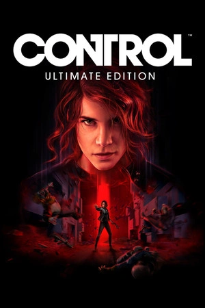

# Control

{: style="height:250px;width:190px"}

**Status**: DNF ❌ 
**Hours played**: 6 

### The Good 👍
- Cool maps and environments
- Some good quests and side quests

### The Bad 👎
- Story did'nt really captivate me
- Probably one of the most boring gunplay/gameplay I've ever played. Its either frustrating and annoying (i.e. the invisible enemy) or mind-numbingly easy.
- Lack of enemy variety 
- No depth of abilities or weapons. Just spam telekenis over and over... zzz
- Why is there a crafting system?

Overall I can understand why some people love it, but this one ain't for me 🤷‍♂️

# SCORE: 4/10