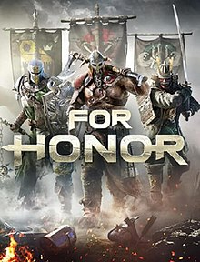

# For Honor

{: style="height:250px;width:190px"}

**Status**: N/A 
**Hours played**: 25 

### The Good 👍
- Very innovative mechanics, I never played anything like it.
- Good hero variety. It's fun to learn the different combos for each one.
- Great with friends, especially doing 1v1s or 2v2s.
- Cool cosmetics.

### The Bad 👎
- Highlander and Shugoki exist.
- Dominion is kinda meh.
- Gear system is pretty weird/confusing.
- No open lobby free for all mode for casual friend play.

# SCORE: 9/10