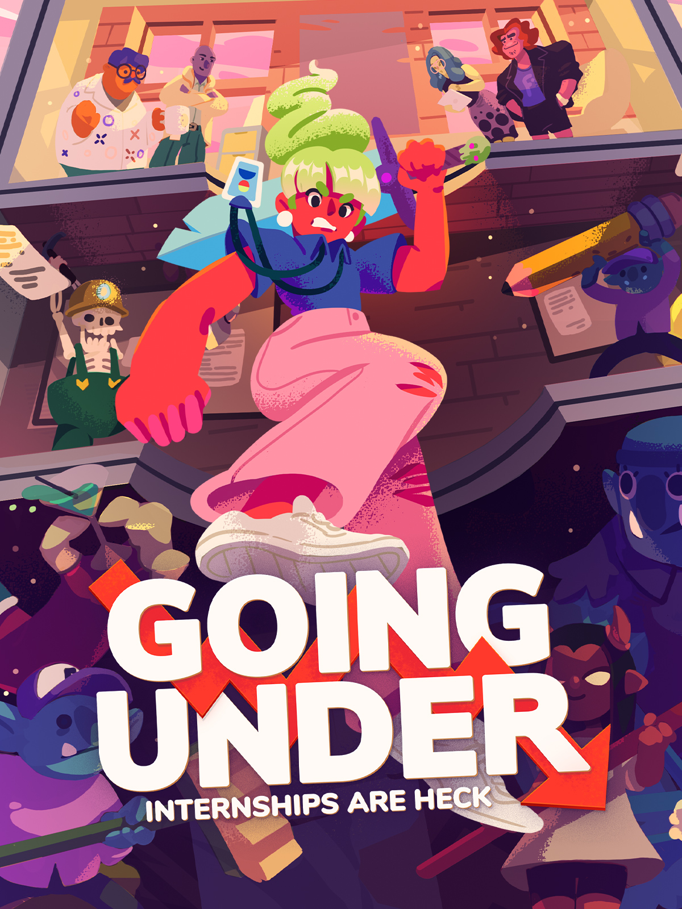

# Going Under

{: style="height:250px;width:190px"}

**Status**: DONE ✅ 
**Hours played**: 9 

### The Good 👍
- Very original setting for a game. Loved all the little references to start-up culture.
- Cute little story with a great cast of characters.
- Great variety of wacky weapons and they nailed the weapon breaking mechanic. It forces you to use different weapons without being annoying.
- Good enemy variety.
- Good soudtrack

### The Bad 👎
- Combat is clunky as fuck. Hit boxes and dodges just didn't feel right sometimes.
- Too difficult for this kinda game (Had to use a bit of assisted mode at the end). If you're going for dark souls levels of difficulty then you gotta make sure the combat feels amazing, it is not the case in this game. The difficulty just wasn't "fun" because of the clunkiness.

# SCORE: 7/10