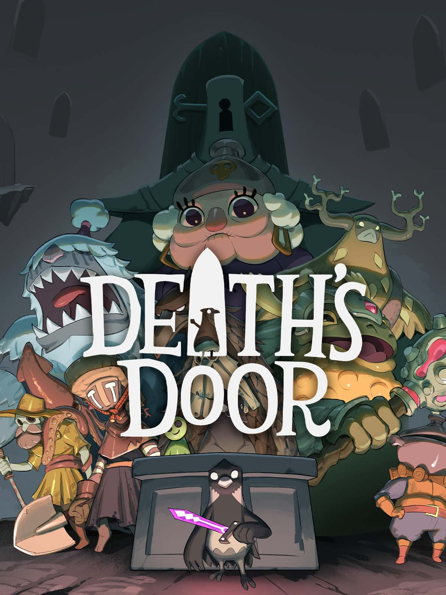

# Death's Door

{: style="height:250px;width:190px"}

**Status**: DONE ✅ 
**Hours played**: 10 

### The Good 👍
- Beautiful zones, characters, music, ambiance etc.
- Great snappy/responsive combat. Felt really good to play. Sometimes the controls/hitboxes in these souls-like feel like shit, but it wasn't the case.
- Solid enemy variety and challenging bosses.
- Good QoL things for a smaller game that removes any possible frustrations (Respawn next to boss, not losing souls on death etc).
- Fun little story.
- I enjoyed seeing areas that I couldn't access yet and remembering that I'll have to come back once I have the ability to.

### The Bad 👎
- More upgrades would've been fun. Something more interessting than just more damage, attack speed etc.
- (Not really a negative) Didn't really feel like doing all the requirements for the secret ending.

# SCORE: 8.5/10