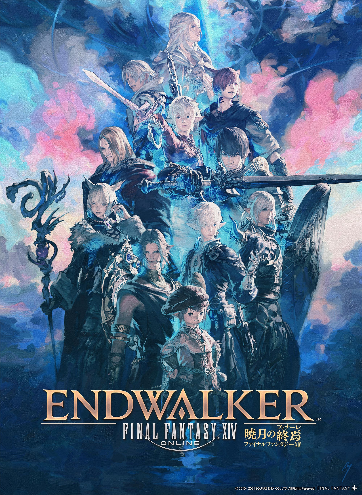

# FFXIV: Endwalker

{: style="height:250px;width:190px"}

**Status**: DONE ✅ 
**Hours played**: lmao 

### The Good 👍
- Great story with great cast and was a strong conclusion to this story arc.
- Great zones.
- Music is as good as ever.
- Raids are fantastic and love the story/setting for them.
- Reaper and sage were amazing job additions.

### The Bad 👎
- Story is a little too wild and complicated to my liking. I prefer a more grounded story personally.
- Starting to see some difficulty creep in some normal dungeons/trials/raids.

# SCORE: 9.5/10