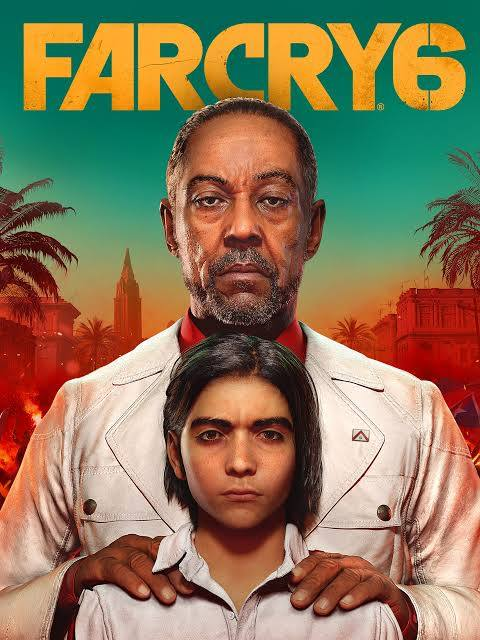

# Farcry 6

{: style="height:250px;width:190px"}

**Status**: DNF ❌ 
**Hours played**: 18 

### The Good 👍
- Pretty cool looking world
- Cock fighting is great
- Some good story moments and interactions
- Some fun gun fights

### The Bad 👎
- Probably the most boring and uninteresting story I've ever witnessed. You see the main villain for like a total of 5 minutes and never actually interact with him throughout the whole game. They introduce a million characters I couldn't give 2 shits about. Ending sucks.
- Gameplay loop is: Go to that zone with enemies, kill all enemies with headshots, mission accomplished, repeat.
- Severe lack of guns and gun customization for a game all about guns. Could've been like borderlands for example and have some sick weapons with cool effects.
- Next to zero enemy and mission variety.
- Good amount of immersion breaking bugs or AI behaviors.
- For some reason, the missions and side-missions scale in level as you level up???????? So even if you try catching up in level you can't... unless you do random world events and grind it out. Fuck that.

Dunkey's video says it best... Super lazy reskin of old farcrys with a MAJOR downgrade in storytelling.

# SCORE: 4/10