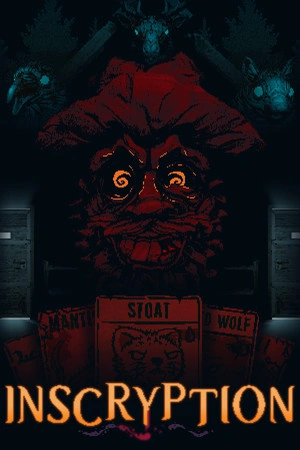

# Inscryption

{: style="height:250px;width:190px"}

**Status**: DONE ✅ 
**Hours played**: 14 

### The Good 👍
- Very fun gameplay. Especially in the first half. Roguelike deck builder is great.
- Great mysterious story that takes some interesting twist and turns.
- Good length
- Good card variety and provides a lot of options and decisions to the player
- Cool art and graphics

### The Bad 👎
- Slightly weaker second half, but I still enjoyed it a lot.

# SCORE: 9/10