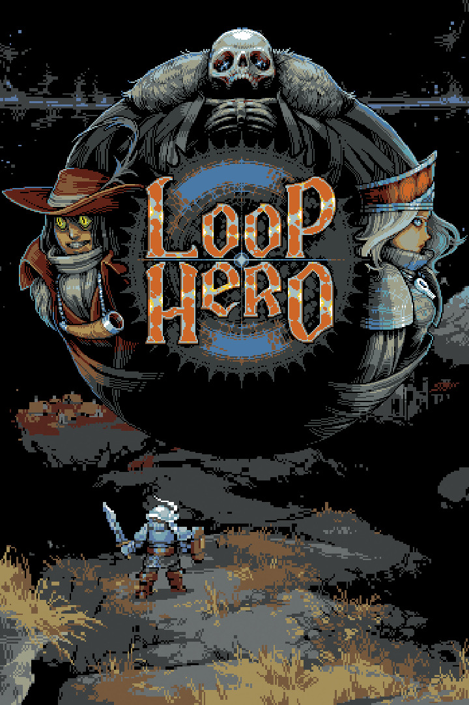

# Loop Hero

{: style="height:250px;width:190px"}

**Status**: DNF ❌ 
**Hours played**: 7 

### The Good 👍
- Very innovative gameplay that I've never seen before
- Easy to jump in and out
- Fun to experiment with builds
- Good and simple story/atmosphere

### The Bad 👎
- Too long to progress through the game and unlock new things. Requires a little too much grinding to my liking.
- Very RNG dependent, which can still be fun, but at the end of the day you can only win with good RNG.
- Got a little boring after a while. Wasn't very motivated to push pass the second level.

# SCORE: 7/10