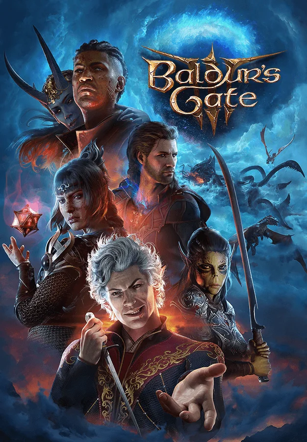

# Baldur's Gate 3

{: style="height:250px;width:190px"}

**Status**: DONE ✅ 
**Hours played**: 137 

### The Good 👍
+ Incredible game. It's amazing to see a truly AAA CRPG. 
+ The amount of possibilty available to the player is great. You can approach most situtations however you want and the results of your actions actually have significant impact on the game.
+ As a D&D fan, they really nailed the mechanics of both combat, RP and exploration and added/removed nice things that make it smoother for a video game.
+ Side-quests and origin character quests are all so good and none of them felt like filler or fetch quests. They were all unique and so fun to do.
+ The main story is very good and offers a lot of options to the player.
+ The origins characters are all amazing and they have really good story arcs. They were probably my favorite part of the whole game.
+ The amount of details in each level/map is so good. It really makes you want to explore every little corner of the map to see if you have possibly missed something. (The only other game that made me want to do that was fromsoft games)
+ The fact that everything is voice acted and well animated is insane. Really helps you to get invested into the story/characters.
+ UI is really user friendly and works well.
+ Combat always felt fair and they don't use cheap tricks to make encounters more challenging.
+ Great replayability with all these possible decisions and builds.
+ Music is epic and has a few bangers.
### The Bad 👎
These are mostly QoL complaints and personal preference things. I don't think they deminish the experience that much and a game of this size is bound to have some, but worth pointing out: 

- Camera is wonky. I especially hate when you freecam then do a range a attack, the camera moves to show the attack and then the camera goes back to centering on your character instead of where it was originally before the attack. And this sometimes causes the camera to zoom on the ground of the level above when attacking so you miss seeing the cool killing blow. The camera is also really weird when exploring a place with multiple levels. I really feel for the devs who had to listen to the designers say "lets have a fight on multiple levels with some sewer tunnels going into a room with even more levels and walls".
- Companions not following you when jumping up or down or companions walking into traps. I feel like I should be able to do those things without having to control them one at a time. (Fixed now)
- Targeting the ground with aoe spells is very glitchy sometimes.
- Some puzzles are REALLY bad, frustrating and have poor UX, but thankfully there aren't a lot
- I think it would've been cool to make it to BG sooner than at the beginning of act 3. Maybe show the city a little bit then lead us towards the story of act 2 idk. It also takes a while for the main story to really kick off.
- I wish the character with the best stat would make the knowledge checks instead of always the character in the convo. (Like history, arcana, religion etc)
- Act 3 had some low moments, but also some of the best moments.

# SCORE: 10/10