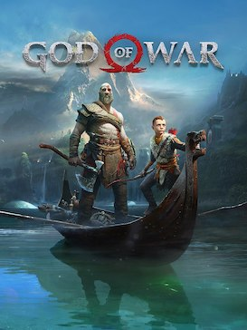

# God Of War (2018)

{: style="height:250px;width:190px"}

**Status**: DONE ✅ 
**Hours played**: 20 

### The Good 👍
- Great story and cast of characters that are very vell acted. Makes you really feel the emotion and the bonds between the characters.
- Level design and puzzles were very good and not annoying.
- Good side missions that develop the characters in small ways and aren't just filler fetch quests.
- Combat is very punchy and satisfying.
- Very cool and cinematic boss fights.
- Fun unlocks and good progression systems.
- Stunning art and VFX/SFX.
- So many QoL things like pausing whenever you want even in cutscenes, in-game dialogue continuing even if you perform another action that could potentially stop it, stories on the boat resuming from where you left off.

### The Bad 👎
- Atreus, my dude, give me like 10 seconds to solve the puzzle before giving the answer. They should make it that its a button requesting a hint from Atreus instead of automatic.
- Combat is very button-mashy and some enemies are HP sponges.
- Story has a bit of a slow start but really picks up in the second half.

# SCORE: 9/10