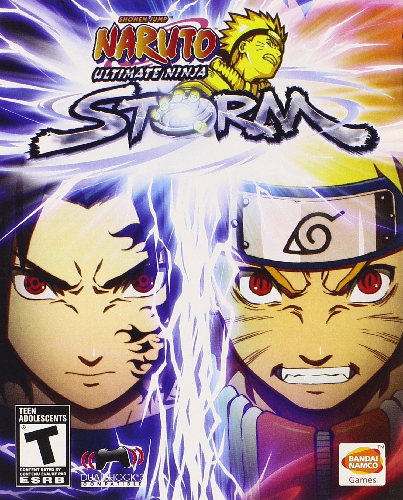

# NARUTO SHIPPUDEN ULTIMATE NINJA STORM 4

{: style="height:250px;width:200px"}

**Status**: DONE ✅ 
**Hours played**: 8 

### The Good 👍
- I had a blast playing this. Just some light brainless game packed with fun moments.
- It was a great way to relive the final arc with re-animated scenes with the game's 3D models.
- Visual effects are insane and really make everything so hype.
- Combat is nice and simple but still allows for some flashy moves.
- Good length

### The Bad 👎
- It's too easy to get stun locked / juggled. Blocking didn't really work that well, but at least there was the dodge mechanic. 
- I wish there were more moves in the player's arsenal. It's all just very spammy. Doesn't have to be hard to execute combos but just something like smash with variety depending on direction and stuff like that.

# SCORE: 7.5/10