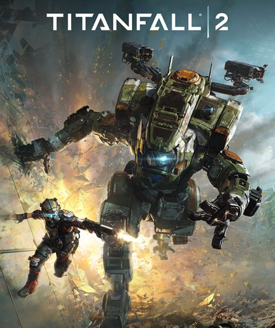

# Titanfall 2

{: style="height:250px;width:190px"}

**Status**: DONE ✅ 
**Hours played**: 5 

### The Good 👍
- Perfect length no bullshit, no filler campaign that just delivers awesome action the whole time.
- Level design is so good. Every level was unique and I especially liked the time switching level.
- Gameplay is super fun as both a pilot and a titan. Guns feel so great and there was a lot of variety.
- Difficulty was perfect on hard. Had some good challenges but still felt strong. Boss fights were really cool.
- Platforming and parkour felt smooth as butter.

### The Bad 👎
- Story is pretty basic call of duty style story.

# SCORE: 9/10