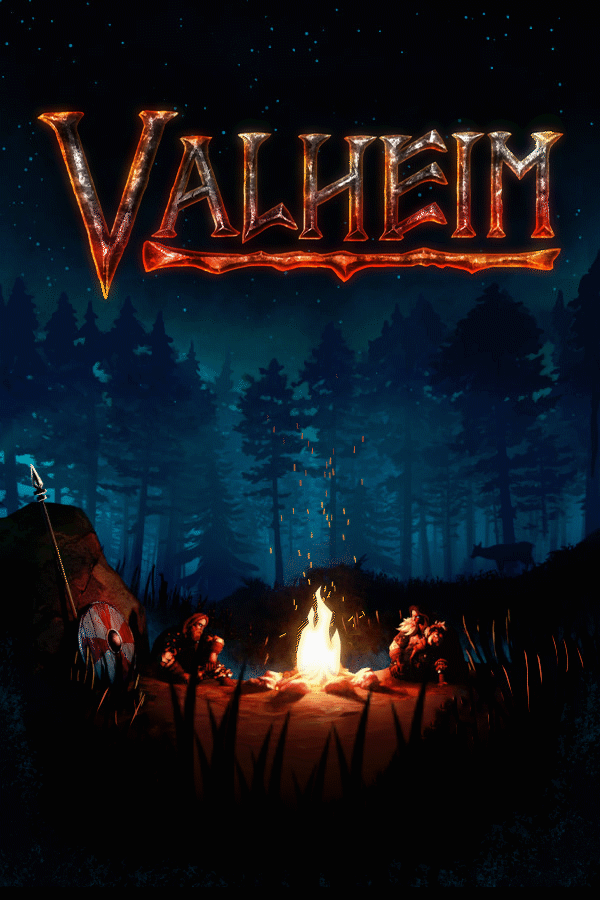

# Valheim

{: style="height:250px;width:190px"}

**Status**: DONE ✅ 
**Hours played**: 74 

### The Good 👍
- Great exploration and the sense of discovery was awesome.
- Good variety of items and things to craft.
- Some fun combat moments.
- The sense of accomplisment when discovering new things was great.
- Early biomes were fun.

### The Bad 👎
- This game is just an escalation of pain in the ass things as you evolve through biomes. Wetness in the swamps then you have to deal with the cold and the mountainous terrain, then yay you're done with that good job, well fuck you go grind a thousand goblin camps to try to find the plains boss. Done with that? Wow good for you now go fuck yourself and enjoy mist, being wet, flying enemies, mountains and islands all at the same time. Instead of using good game design and creative ideas to make it more challenging they just throw annoyance at you and calling it "difficulty".
- The stamina bar like whyyyyyy... so unfun. I understand why its there but just make it regen faster in late game man. I dont wanna run for 10 sec to wait for 15 sec for it to regen.
- The leveling system is just plain broken for what the game loop is supposed to be. Once you hit ~30 in a level you pretty much peaked because dying with set you back a lot. The game really lacks in progression outside of gear.
- Taking the boat to bring back ore was fun once then it became an enormous pain.
- Building was jank.
- Combat was jank.
- Shit server code.

# SCORE: 6/10