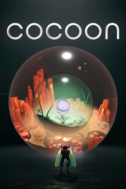

# Cocoon

{: style="height:250px;width:190px"}

**Status**: DONE ✅ 
**Hours played**: 3.5 

### The Good 👍
- Fun game with clever puzzles that aren't too complicated but still require some thinking
- Visuals are really beautiful and the seamless transitions between worlds is really satisfying.
- Sound and music are great and add a lot to the vibe of the game.
- The boss encounters are really enjoyable and well designed.
- Love the simplicity of the game. No HUD, no explaining mechanics etc.

### The Bad 👎
- Its a good length, but puzzles got a little repetitive towards the end.

# SCORE: 8/10