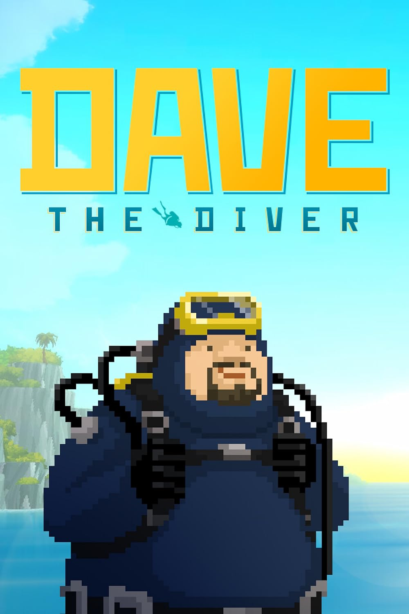

# Dave The Diver

{: style="height:250px;width:190px"}

**Status**: DONE ✅ 
**Hours played**: 26 

### The Good 👍
- Fun laid back game with a surprising amount of depth.
- Cute little story with interesting characters. Cutscenes were always funny and original.
- Gameplay loop is very fun. Catching fish, make some sushi, make some money and upgrade your stuff.
- Really good variety of things to catch and just things to do in general.
- There's a crazy amount of different small little mechanics and "mini-games". Every boss encounter had something different to it.
- Art is really pretty and music is vibey.

### The Bad 👎
- Not a fan of mashing the A button to catch a fish. It just kills the chill vibe of hunting for fish imo. There's even a setting to automate that, but its way less efficient than mashing so I don't really understand why its there.

# SCORE: 9/10