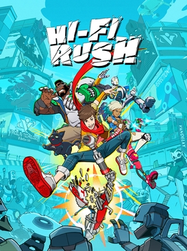

# Hi-Fi RUSH

{: style="height:250px;width:190px"}

**Status**: DONE ✅ 
**Hours played**: 12 

### The Good 👍
- One of the smoothest games I've ever played. From gameplay, to animations to art. Everything just flows so perfectly and feels so freaking good to play. I really love how every thing in the world moves along to the beat. The attention to detail is insane and Tango really delivered a high quality game.
- Combat is really one of a kind and is super fun. Combos and staying on beat give you better scores and a bit more damage, but messing it up doesn't ruin the experience at all. Perfect balance of being challenging with a high skill cap without being punishing for the player when they mess up. You can really spend a lot of time mastering the combat in this game, but you can also get by easily by focusing on learning a few combos.
- Really good enemy variety. They all have a different set of moves and weaknesses.
- Interesting upgrades and unlocks. There's unlocks for new combos and moves, but also just raw stats.
- Boss fights are really fun and unique. Each of them having special mechanics to defeat them.
- Exploration and platforming are both super fun and never overwhelming. I Like having to use the companions to get through a level.
- Level design is great. Every level felt unique and very on theme with the story. No filler kinda levels or areas. I liked the random NPC encounters with the robots.
- The story is really good and captivating. There's a bunch of epic moments in the story that make you go FUCK YEAH.
- There's an amazing cast of characters and villains with very talented VAs.
- The art style is just stunning and so perfect for the game. Both levels and cutscenes really take advantage of it.
- Music and sound are top notch. 
- Good length + some fun bonus content at the end.
- Made me want to come back and replay the game on harder difficulty one day.

# SCORE: 10/10