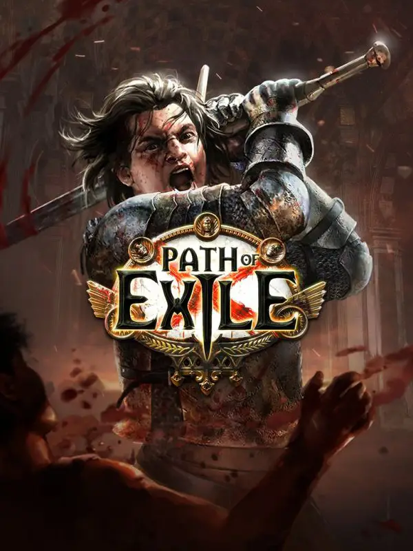

# Path of Exile

{: style="height:250px;width:190px"}

**Status**: DONE ✅ (The campaign)  
**Hours played**: 44 

### The Good 👍
- Very good ARPG gameplay. Has that satisfying oomph when killing waves of enemies.
- Tons of builds to try that are all very different.
- Gives you that great power fantasy when your build finally comes online.
- Good enemy and boss variety.
- The depth of each build and itemization is fun to get into and optimize once you start understanding how the game works.
- Maps are kinda fun and I like that its easy to jump in and progress.

### The Bad 👎
- Very hard to get into as a beginner. I wish there was more in-game help to progressively teach you different aspects of the game. While the depth is fun to get into its also very overwhelming.
- Maps get repetitve and grindy, but I guess that's every ARPG.
- I wish it was easier to respec a character to try out different builds.
- Sucks that there's no way to look cool without using irl money.
- Didn't really care to pay attention to the story.

# SCORE: 8.5/10