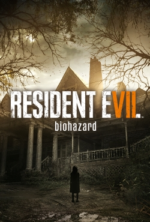

# Resident Evil 7 Biohazard

{: style="height:250px;width:190px"}

**Status**: DONE ✅ 
**Hours played**: 9 

### The Good 👍
- Before playing this, I honestly wasn't sure I'd be able to handle RE games, but its the perfect kind of horror game for me. The settings and environments are very spooky and unsettling, but they never rely on cheap jump scares out of nowhere to scare the player.
- I really enjoyed the world and exploring it.
- The mix of action and horror is very fun to play. The game strikes a perfect balance with loot. I had to be prudent with my bullet use, but I also never felt stuck with nothing on me.
- Puzzles were interesting and not too challenging except 1 or 2.
- The level art is amazing. Sets such a good ambiance.
- Great characters and story line.
- Sound design is really good. 
- Good length at around 9 hours.

### The Bad 👎
- Wish there was a better way to avoid attacks in some boss fights rather than just slowly strafing.

# SCORE: 9/10