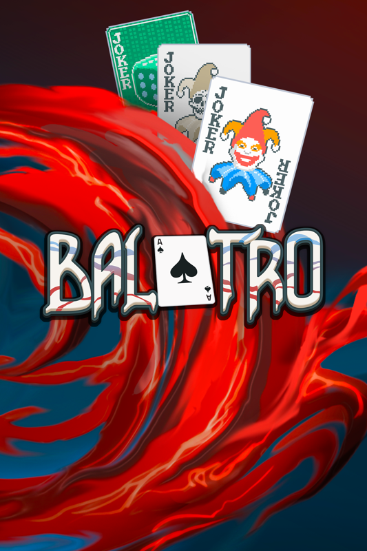

# Balatro

{: style="height:250px;width:190px"}

**Status**: Beat the game on a bunch of decks and different difficulties, but didn't unlock everything 
**Hours played**: 20 

### The Good 👍
- Big number go boom game. This game has very fun combos and when you get all the things you need to get your "engine" going it's very satisfying and you feel like nothing can stop you.
- Cool twist on poker. We all know the basic rules so its easy to jump in and understand the game.
- Love that you can accelerate the game speed. Made it much more enjoyable. 
- Sfx and vfx are top-notch. Really nails that satisfying crescendo of effects when you pull off that sick combo.
- It's fun to unlock new jokers and cards.

### The Bad 👎
- Never really got hooked by this game like some other people. I was warned "omg you'll be so addicted to this game" and meh it didn't do it for me.
- Even though there's a lot of jokers, I feel like the build variety is quite scarce. At least half the jokers are really bad, 35% are situational and 10% are really good. So I felt like I kept gravitating towards those run winning jokers and didn't mess around with different builds much. And even then, playing a "different" build didn't really feel that different gameplay wise.
- I wish there was more deck building to the game. Yes you can add some cards to your deck during a run, but it didn't change much.
- The game got repetitive pretty fast for me and after 20 hours I feel like I've had enough. (Which is still good!). I had a lot of fun with it and it's worth checking out, but I guess with all the critical praise it was getting I was expecting a little more out of it. Might jump back on here and there to play a quick run during a boring meeting about how working at the office helps productivity.

# SCORE: 8/10