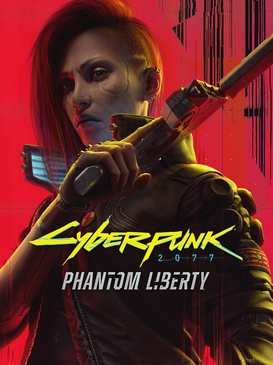

# Cyberpunk 2077: Phantom Liberty

{: style="height:250px;width:190px"}

**Status**: Done ✅  
**Hours played**: 21 

This also serves as a review for Cyberpunk 2077 2.0 update since I haven't gone back to play the game since it came out.

### The Good 👍
- The PL story was well written and had some very interesting characters. It felt a little darker and more dystopian. There's various possible endings and it feels like some player choices really do matter.
- The voice acting was top-notch. I thought Idris Elba did an amazing job as Reed and played the character really well.
- The missions were really fun and varied. 
- The side missions had the same quality as the main missions and all felt unique.
- Dogtown was a cool city to explore and I liked the theme of it. The environments were gorgeous and very well crafted.
- The 2.0 perks and combat felt really good to play. I had fun making my build and combat felt less janky than before.
- The world felt a lot more alive in 2.0. More cars, more pedestrians that react to your actions. The police shows up and chase you if you start a killing-spree.

### The Bad 👎
- The PL characters are a little more "rough" than in the base game and I didn't get the same sense of attachment to the characters as I did with the base game.
- While 2.0 brought the game to a much more complete state, I still feel like it has some work left to do to make the living world feel like GTA quality. 

# SCORE: 9/10