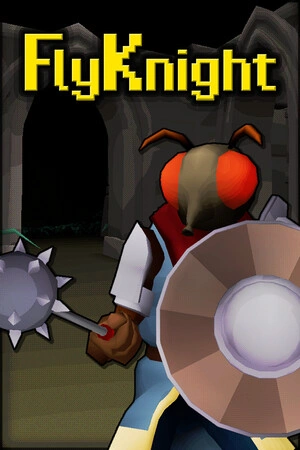

# FlyKnight

{: style="height:250px;width:190px"}

**Status**: Done Coop ✅ 
**Hours played**: 2.5 

### The Good 👍
- Fun and original gameplay. The combat felt pretty solid for a souls-like indie game.
- Very good variety of weapons for a game of this size and it felt really nice to find a chest with new gear in it. 
- The coop gameplay made it really fun and it worked well.
- The level design and enemy design were both very solid.

### The Bad 👎
- The freaking Valheim-style stamina. I get why its there so you don't spam attacks, but its so annoying to sprint for 4 seconds then walk for 6 seconds etc. The walk felt way too slow compared to the sprint. It made the game feel a little sluggish and slow.
- Encountered a few bugs *finger-guns*. Like I couldn't attack anymore or the elevators going the wrong way on my screen.
- A little short. This type of game should be pretty short, but a couple more hours could've been fun so i could've used the cool gear a little more.

# SCORE: 7/10