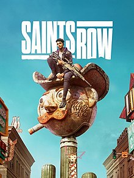

# Saints Row

{: style="height:250px;width:190px"}

**Status**: DONE COOP ✅ 
**Hours played**: 10 

### The Good 👍
- Had a couple "it's so bad its good" moments.
- Character customization was well done. I had fun dressing up my character between each mission.

### The Bad 👎
Where to even begin...

- The writing is abysmal. The story is laughably bad. Cringe unfunny voice lines, a plot that wasn't interesting at all, just nothing appealing about the writing at all. And as the main character you're just a massive asshole, but not in a funny way.
- Voice acting is rough. Voice actors themselves are decent, but the writing is so bad that it just couldn't be redeemed with good acting.
- The quests design is worse than PS2 era games. Go here to talk to NPC, kill bad guys. How fun. And like 40% of the main quests are that awful LARP questline that felt really shoehorned in. I was bored doing most quests.
- The "open" world is just a completetly empty desert with NOTHING interesting to look at. Just orange sand everywhere and a couple regular looking buildings.
- The world doesn't feel alive at all. There's no random pedestrian encounters, no cops chasing you for killing someone etc. Just empty orange desert.
- The vehicles control like absolute shit. The physics are trash when driving them.
- The game unplayable on controller. It's not just hard to aim, it's impossible. I was forced to use mouse and keyboard.
- Combat was very mediocre. Some interesting guns, but every enemy was the same. Never felt difficult and never had a "oh shit here comes the big bad guy" moment.
- The takedown animations were like 5 seconds each which would just cut the flow of combat completely. It takes 1 second to kill them with a gun, but a takedown takes 5? Why would I ever takedown?
- The popping is INSANE. Now, this game doesn't have your regular old popping where as you approach an object it will spawn in the world. No no, in Saints Row the objects DISSAPEAR as you get closer to them. Yup they get spawned properly without a visual glitch, but as you approach it gets despawn. Cars would just pop out as you drove closer to them. ?????????
- The graphics are very ugly. Especially textures. So many times I would point out how dogshit certain things looked.
- The online coop had pretty significant delay. I would crash into my friend's car on my screen, but on their screen I was like 10 feet away. 
- I shit you not, there's no music in this game except the radio in the car. Every "epic" battle was done in complete silence. Was so weird and underwhelming. 
- They kill Sergio with zero fanfare. Like he didn't matter at all to us 😭

I don't how so many critics gave this a somewhat positive score... It's funny to suffer together with friends, but the game itself is really really bad.

# SCORE: 1/10