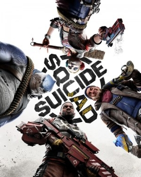

# Suicide Squad: Kill the Justice League

{: style="height:250px;width:190px"}

**Status**: Done Coop ✅ 
**Hours played**: 11 

### The Good 👍
- You can see that a lot of effort and polish from a very talented team went into this. The quality of animations, cutscenes, art, VFX etc. was great.
- The character navigation and parkour is really good and satisfying. Jumping and climbing from building to building was well made.
- Combat mechanics were solid and also pretty satisfying. There was a good variety of weapons and grenades. 
- The story is interesting at times and voice acting was good.

### The Bad 👎
- The fact that this game is a live service. Why are there lootboxes, battlepasses, 12 different in-game currencies in a single-player/coop story game. Once we beat the game we had to grind insane amounts of battlepass XP to do the main quests for the live service seasons.
- They just decided to hand out by far the best weapons at the beginning of the game (I assume it was to attract players once the game failed). Every single weapon drop we received after that did about a quarter of the DPS of our starting weapons. No weapon came even close to being as good, so every lootbox felt meaningless. Weird.
- The UI is way too busy and cluttered.
- There are only 3 mission types. Whether it was a main quest, side quest or openworld grind quest, they were all either: go here and kill all enemies, escort this vehicule and kill all enemies, defend this point and kill and enemies. 
- There's basically no enemy variety. There's maybe like 4 different enemies. So even though the combat mechanics were well made the encounters were so repetitive that it just ruined all combat.
- Boss fight design was laughably bad. They were all very boring and underwelming. We are fighting the justice league ffs it should feel like an epic battle and that they are hard to kill. And let's not forget that batman boss fight where you play only one player at a time slow-walking across a super dark room looking for switches to press while the other watches. Once you've pressed all the switches it's time for the epic showdown against a giant demon batman! Only for that fight to last about 4 seconds where we stood still and unloaded one magazine each to kill batman. Great design guys. 
- The writing was rough. There were so many jokes and quips that just fell flat.
- Joining a friend takes between 10-20 minutes sometimes. Loading in takes forever and would sometimes result in an error.
- Performance was quite bad. I would get 30-40fps and frequent frame drops on a mix of low and medium settings on a 3070.

You can clearly see that this game was made by a really talented team and it would've made for a solid game if they weren't forced to turn it into live-service slop 😔

# SCORE: 3/10